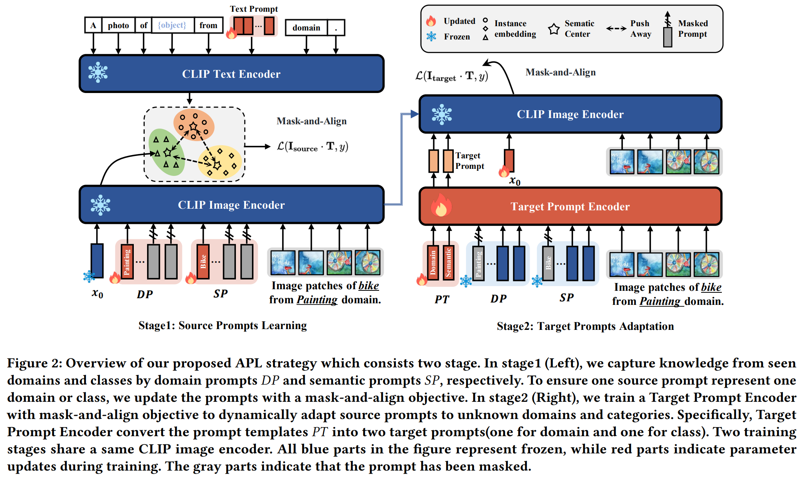

# Adaptive Prompt Learning

Official github repository for **Learning to Prompt Adaption for Universal Cross-Domain Retrieval**. Please refer to [paper link](https://openreview.net/pdf?id=QEpMwcDaKX) for detailed infomation.

> Abstract: Universal Cross-Domain Retrieval (UCDR) aims to find relevant images across various unknown domains and categories. It requires a model to handle both domain shift (\ie, unknown domains adaptation) and semantic shift (\ie, unknown categories transferability). Recent studies address the above issues by leveraging expert knowledge from semantic information or pre-trained models as guidance to fine-tune model. However, such a fine-tuning paradigm results in loss of generalization ability due to corruption of original model.In this paper, we present a novel paradigm built upon the recent promising prompt learning to address it. Our method, named Adaptive Prompt Learning (APL) dynamically captures domain and semantic shift and then effectively rectifies them. Specifically, source prompts, which hold base knowledge from source domains and semantics, are obtained by the first stage source prompts learning. Then in the second stage, target prompts that adapted to target domains and semantics are inferred with guidance of the above source prompts. Such a procedure is done adaptively by feeding input and source prompts to a target prompt encoder. Both of two stages are trained with a unified mask-and-align objective to achieve the goal. With the design of APL, the proposed method is evaluated to be effective on three benchmark datasets. Results show that our method significantly outperforms current state-of-the-art by a superior margin for both domain and category generalization, with a $17.92\%$ average performance improvement for mean Average Precision. Moreover, the proposed method also has large performance to conventional prompt tuning under all settings. Our method is publicly available at \url{https://anonymous.4open.science/r/APL}..



## Requirements

Our implementation is tested on Ubuntu 18.04.5 with Tesla V100-SXM2-32GB. Supports for other platforms and hardwares are possible with no warrant. To install the required packages:

```bash
conda env create -f APL.yaml
conda activate APL
```

## Data Preparation

1. Download DomainNet, Sketchy and TU-Berlin using scripts in `./APL/downloads`.

   ``` bash
   cd ./APL/downloads
   bash download_domainnet.sh
   bash download_sketchy.sh
   bash download_tuberlin.sh
   ```

2. The directory is expected to be in the structure below:

   ```python
   ├── DomainNet
   │   ├── clipart # images from clipart domain
   │   ├── clipart_test.txt # class names for testing
   │   ├── clipart_train.txt # class names for training
   │   ├── down.sh
   │   ├── infograph
   │   ├── infograph_test.txt
   │   ├── infograph_train.txt
   │   ├── painting
   │   ├── painting_test.txt
   │   ├── painting_train.txt
   │   ├── quickdraw
   │   ├── quickdraw_test.txt
   │   ├── quickdraw_train.txt
   │   ├── real
   │   ├── real_test.txt
   │   ├── real_train.txt
   │   ├── sketch
   │   ├── sketch_test.txt
   │   └── sketch_train.txt
   ├── Sketchy
   │   ├── extended_photo
   │   ├── photo
   │   ├── sketch
   │   └── zeroshot1
   └── TUBerlin
       ├── images
       └── sketches
   ```

## Run

- To perform a training and evaluation for APL in three different datasets, use the scripts in `./APL/src/alogs/APL/reproduce_runs.sh`:

```bash
# DomainNet
python3 main.py -data DomainNet -hd sketch -sd quickdraw -bs 50 -log 15 -lr 0.0001 -use_NTP 0 -tp_N_CTX 16 -GP_CLS_NUM_TOKENS 1 -GP_DOM_NUM_TOKENS 1 -debug_mode 0 
python3 main.py -data DomainNet -hd quickdraw -sd sketch -bs 50 -log 15 -lr 0.0001 -use_NTP 0 -tp_N_CTX 1 -GP_CLS_NUM_TOKENS 1 -GP_DOM_NUM_TOKENS 1 -debug_mode 0 
python3 main.py -data DomainNet -hd clipart -sd painting -bs 50 -log 15 -lr 0.0001 -use_NTP 0 -tp_N_CTX 16 -GP_CLS_NUM_TOKENS 1 -GP_DOM_NUM_TOKENS 1 -debug_mode 0 
python3 main.py -data DomainNet -hd painting -sd infograph -bs 50 -log 15 -lr 0.0001 -use_NTP 0 -tp_N_CTX 16 -GP_CLS_NUM_TOKENS 1 -GP_DOM_NUM_TOKENS 1 -debug_mode 0 
python3 main.py -data DomainNet -hd infograph -sd painting -bs 50 -log 15 -lr 0.0001 -use_NTP 0 -tp_N_CTX 16 -GP_CLS_NUM_TOKENS 1 -GP_DOM_NUM_TOKENS 1 -debug_mode 0 

# Sketchy
python3 main.py -data Sketchy -bs 50 -log 15 -lr 0.0001 -use_NTP 0 -tp_N_CTX 16 -GP_CLS_NUM_TOKENS 1 -GP_DOM_NUM_TOKENS 1 -debug_mode 0 

# TUBerlin
python3 main.py -data TUBerlin -bs 50 -log 15 -lr 0.0001 -use_NTP 0 -tp_N_CTX 16 -GP_CLS_NUM_TOKENS 1 -GP_DOM_NUM_TOKENS 1 -debug_mode 0 
```

- To perform a training and evaluation for CLIP-Prompted in three different datasets, use the scripts in `./APL/src/alogs/CLIP-Prompted/reproduce_runs.sh`:

```bash
# DomainNet
python3 main.py -data DomainNet -hd sketch -sd quickdraw  -bs 256  -es 2 -lr 0.001  -log 15 -e 100 -ts TP+VP 
python3 main.py -data DomainNet -hd quickdraw -sd sketch  -bs 256  -es 2 -lr 0.001  -log 15 -e 100 -ts TP+VP 
python3 main.py -data DomainNet -hd painting -sd infograph  -bs 256  -es 2 -lr 0.001  -log 15 -e 100 -ts TP+VP
python3 main.py -data DomainNet -hd infograph -sd painting  -bs 256  -es 2 -lr 0.001  -log 15 -e 100 -ts TP+VP
python3 main.py -data DomainNet -hd clipart -sd painting  -bs 256  -es 2 -lr 0.001  -log 15 -e 100 -ts TP+VP

# Sketchy
python3 main.py -data Sketchy -bs 256  -es 2 -lr 0.001  -log 15 -e 100 -ts TP+VP -debug_mode 0

# TU-Berlin
python3 main.py -data TUBerlin -bs 256  -es 2 -lr 0.001  -log 15 -e 100 -ts TP+VP -debug_mode 0

```

- To perform a training and evaluation for CLIP-Baseline in three different datasets, use the scripts in `./APL/src/alogs/CLIP-Baseline/reproduce_runs.sh`:

``` python
# DomainNet

python3 main.py -hd sketch -sd quickdraw -bs 512 -es 5 -lr 0.001 -clip_bb ViT-B/32 -log 15 -e 100 -ts LP -debug_mode 0
python3 main.py -hd quickdraw -sd sketch -bs 512 -es 5 -lr 0.001 -clip_bb ViT-B/32 -log 15 -e 100 -ts LP -debug_mode 0
python3 main.py -hd clipart -sd painting -bs 512 -es 5 -lr 0.001 -clip_bb ViT-B/32 -log 15 -e 100 -ts LP -debug_mode 0
python3 main.py -hd painting -sd infograph -bs 512 -es 5 -lr 0.001 -clip_bb ViT-B/32 -log 15 -e 100 -ts LP -debug_mode 0
python3 main.py -hd infograph -sd painting -bs 512 -es 10 -lr 0.001 -clip_bb ViT-B/32 -log 15 -e 100 -ts LP -debug_mode 0

# Sketchy
python3 main.py -data Sketchy -bs 480 -es 3 -lr 0.001 -clip_bb ViT-B/32 -log 15 -e 100 -ts LP -debug_mode 0

# TUBerlin
python3 main.py -data TUBerlin -bs 480 -es 3 -lr 0.001 -clip_bb ViT-B/32 -log 15 -e 100 -ts LP -debug_mode 0
```

